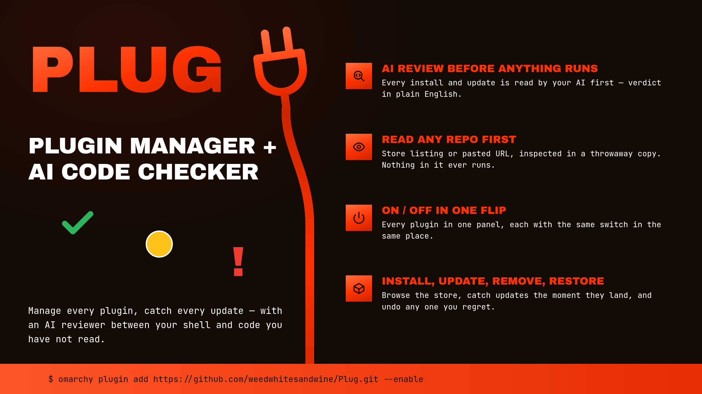

# Plug

**Manage all your plugins, catch every update, and have AI scan the code BEFORE you update or install.**



Plugins run as you, with no sandbox. A plugin you install is code you have not
read, and an update is more of it. Plug manages your installed community plugins
— toggle, remove, browse and install more — and puts the same gate in front of
both moments: before a plugin is installed, and before an update is applied, an
AI reviewer of your choice reads the actual code and tells you, in plain
English, whether it is safe.

## What it does

- **Installed** — every community plugin you have, each row with the same four
  controls in the same place: **update**, **restore**, **remove** and an
  **on/off** switch. The update control lights **green** the moment the
  plugin's repository has moved past what you installed; restore lights up once
  Plug has applied an update it can undo. Laid out two-up to save space, with a
  folded **Official** section for Omarchy's own optional bar widgets — those
  show just the on/off switch, lined up with the community rows (a built-in is
  part of Omarchy, not an installed copy, so there is nothing to update or
  remove).
- **The trust mark** on each row — a check, a circle, or an exclamation —
  is a quick capability read of the plugin's
  source — what it can reach, run and write — and it is one of three things,
  never a number:
  - ✅ **Green check — squeaky clean.** Nothing that leaves the machine, nothing
    alarming even mentioned, no install step. It keeps to itself.
  - ❗ **Red exclamation — read it first.** Not a stop sign:
    a warning that this needs your eyes. Code that *actually runs* one of:
    reading private files (`.ssh`, `id_rsa`, `.gnupg`,
    keyring, `/etc/shadow`), or hiding itself behind an encoder (`atob`,
    `eval`, a packed line). No listed plugin is expected to be red. If it
    appears, read the code before anything else.
  - 🟡 **Amber circle — the honest middle.** It reaches the network, has a setup
    script that installs or escalates, runs privileged commands (`sudo`/`pkexec`) or a package
    manager, or merely *displays* any of those for you to copy — the reason
    on the row says which. A capability held openly is not an accusation;
    most useful plugins live here.

  **The row always says which.** "reaches the network", "has a setup script",
  "shows you commands as root" — a colour you cannot account for is worse than
  no colour, so the reason travels with it.

  Run versus show still decides the wording on the row: a plugin printing
  `sudo systemctl enable …` on screen for you to copy is being helpful, and
  one running it holds a capability worth naming. Comments are ignored
  entirely, and a long line counts as packed content only when nothing breaks
  it up.

  There was a 0–100 score here until 2026-08-30. It implied a precision this
  scan has never had — nobody could say what 44 meant, the weights behind it
  were invented, and it put a plugin that talks to earbuds below one that
  clones strangers' repositories for a living.
- **Review an update** — Plug fetches the exact changes, runs a fast offline
  scan, and hands the diff to your chosen AI reviewer (read-only). You get a
  **safe / be careful / do not** verdict, a plain-English summary of what
  changed, anything to watch for, and the author's own commit notes — then you
  decide. It also judges the update the way the marketplace's own approval
  checks do (new privileges, downloads, network hosts, background processes, or
  writes outside the plugin). The reviewer is told which question it is
  answering — a first install, or a change to something already installed.
- **Restore** — undo the last update you applied, returning the plugin to the
  version it was on before. Plug then flags the update as available again, so
  nothing is lost — you can re-apply it whenever you are ready.
- **Store** — search the community marketplace, and **read a plugin before you
  install it**. Pressing install does not install: Plug clones the plugin to a
  throwaway directory, scans what it can do, has your reviewer read the whole
  source, and tells you plainly whether it looks safe — then you decide, with
  the button reading **Install anyway** if the answer was no. The copy is
  deleted either way, and nothing in it is ever run. Double-click a row to open
  the plugin's own repository page. Omarchy's built-in plugins appear here too,
  marked **OFFICIAL** and shown for discovery only.
- **Any repository, listed or not** — paste a GitHub address into the Store's
  search box and Plug offers to read that, exactly the way it reads a catalog
  entry. Plenty of plugins are never listed — a link in a forum, a friend's
  repo — and those are the ones that have had the least scrutiny, so they are
  the ones most worth reading first.
- **Manual installs** — adding a plugin only copies its files and enables it;
  it builds nothing and starts nothing. A plugin that needs packages, a
  compiled daemon or a service therefore ships a script and expects you to run
  it, and that script runs as you the moment you start it, before any of the
  plugin's own code loads. Plug finds that script, reads it, lists what it
  would do to your machine, and hands you the commands — it will not run it
  for you. Reviewing code and then executing it is the one thing this plugin
  exists not to do.

## Choosing your reviewer

The reviewer is entirely your choice, set in **Settings**. Plug offers only the
tools you actually have:

- **Claude Code** — if the `claude` command is installed. It is run once, in
  an empty working directory, in plan mode with no tools at all, and under a
  throwaway home directory holding only its own Claude settings — the
  environment it sees carries its own credentials and nothing else your shell
  or your real home was carrying. It reads the diff it was given and has
  nothing else to act with.
- **Opencode** — if the `opencode` command is installed **and** `bwrap`
  (bubblewrap) is, because Opencode keeps its own tools and Plug will not run a
  reviewer with tools outside a sandbox. It runs inside one: its home is a
  throwaway in memory, its working directory is empty, the system is mounted
  read-only, and nothing of your real home is inside it except the Opencode
  program itself and its own credentials. Its settings in there are Plug's, not
  yours, and they deny editing, shell commands and web fetches; its plugins are
  switched off. It can reach its model and nothing of yours. Models are listed
  from Opencode itself with its free tier first, and a free one is the default,
  so choosing this reviewer does not spend provider credit unless you pick a
  model that does.
- **Local servers** — Ollama or LM Studio, if they are running. The review is a
  request to `localhost`, so **nothing leaves your machine** — a real LLM review
  that is completely private. Their loaded models are listed automatically.

- **Just the offline scan** — no AI at all; Plug reports what its own capability
  scan found. Everything stays local.

Interactive apps such as ChatGPT Desktop or Grok Bot are not offered: they are
windows, not something Plug can call for a one-shot review.

Authentication belongs to the reviewer you chose: Plug runs its command, and
that command uses the sign-in it already has. With Claude Code, that is the
Claude account set up in your terminal; with Opencode, whatever
`opencode auth login` saved, or a provider key already in your environment. If
the tool is not signed in, the review falls back to the offline scan.

**Privacy.** A reviewer that runs somewhere else — Claude Code, or Opencode on
a provider model — is sent the code it is asked to judge, and only then: the
diff when you review an update, the plugin's full source when you check one
before installing it. That code is public and comes from a public repository,
but it does leave your machine. A local server (Ollama, LM Studio) or the
offline scan keeps everything on it.

## Install

```
omarchy plugin add https://github.com/weedwhitesandwine/plug.git --enable
```

Open it from the bar icon, or from a terminal:

```
omarchy-shell shell toggle io.github.weedwhitesandwine.plug
```

A hotkey is **off by default** — set one in Settings if you want. Plug checks
every shortcut Hyprland is actually using (including Omarchy's own, which are
not in `bindings.lua`) and refuses a combination that is already taken.

## Update

```
omarchy plugin update io.github.weedwhitesandwine.plug --yes
```

## Remove

Hide the bar icon and clear the hotkey in Settings first (that removes Plug's
entry from `shell.json` and its block from `bindings.lua`), then:

```
omarchy plugin remove io.github.weedwhitesandwine.plug
```

Its state is left in `~/.local/state/plug/`, which you can delete.

## What it runs, reads and writes

**Its own state**, all inside `~/.local/state/plug/`: `state.json` (git and
scan results per plugin), `catalog.json` (the marketplace catalog, cached),
`settings.json` (your choices), `locks.json` (restore bookkeeping — which
version each applied update came from), `review-<plugin-id>.json` (the last
review of that plugin: the verdict, the summary, and the two commits it was
read between, which is what the apply is checked against), and
`outcome.json` (the result of the last job — written when an install, update,
restore or removal finishes, shown and deleted the next time Plug opens), and,
if you use Opencode, `opencode-models.json` and `opencode-bin.json` (its model
list and where its program actually lives, both cached so Plug does not ask
again on every settings open).

**Outside its own directory** — only in response to something you do:

| Path | When |
|---|---|
| `~/.config/hypr/bindings.lua` | only when you set or clear a hotkey, and only Plug's own marked block, between `-- >>> plug hotkey` and `-- <<< plug hotkey`, along with the blank line it writes above that block. Resolved the same way if it is a dotfiles symlink |
| `~/.config/omarchy/shell.json` | only when you show or hide the bar icon. It adds, moves or removes its own `{"id": …}` entry and leaves every other setting as it found it, though the file is rewritten as standard JSON with two-space indentation. Where a dotfiles manager has symlinked this path into its own repository, the link is resolved and the real file written, so the link survives |
| a plugin's own checkout under `~/.config/omarchy/plugins/…` | `git fetch` against every installed plugin's remote each time the panel opens (the update check, which you can turn off with `autoCheck`) and each time you press **Check for updates**; and, for the one plugin you act on, a fast-forward when you update it or a `reset` when you restore it |
| a temporary directory | two things, both read and then deleted: a shallow clone of a plugin you asked Plug to check before installing, and — when you review an update — a copy of the incoming version's files extracted from the plugin's own repository, so the reviewer reads the new code rather than only the diff |

**Commands it runs:** `python3` (Plug's own engine, `plugd.py` — every job
goes through it); `omarchy-shell shell listPlugins` / `listShellConfig` /
`setPluginEnabled` (read the list and your shell config; enable/disable on your
click); `omarchy-restart-shell` (only after you apply an update or a restore —
see below — and never while the screen is locked) with `omarchy-shell shell
ping` / `summon` to bring Plug back afterwards; `omarchy plugin add` / `remove`
(install/uninstall on your click); `git` inside each plugin's checkout (read its
state, fetch updates, show the diff, apply or revert); `hyprctl binds` (read
active shortcuts) and `hyprctl reload` (after a hotkey change); `bash` (Plug's
own `plug-ctl.sh`, which holds the two consent edits: the hotkey block and the
bar-icon entry); `wl-copy` (only when you press **Copy the commands** on a
manual install, with the commands passed as an argument rather than through a
shell); `xdg-open` (only when you open a plugin's repository page); and the AI
reviewer you chose — the `claude` command, the `opencode` command inside a
`bwrap` sandbox (with `opencode models` to list what it can run), or a request
to a local server on `localhost`.

**What runs when the shell starts.** Plug builds its reviewer list once, as the
shell loads it. That run does three things: `which claude` and `which opencode`;
an HTTP request to `localhost:11434` and `localhost:1234` to see whether Ollama
or LM Studio is listening; and, if Opencode is installed and its saved model
list is more than a day old, `opencode models` to refresh it — which on installs
where `opencode` is a wrapper resolves its package through the network. That
list is then read from disk until it ages out again. Both requests go to the loopback interface and ask one question —
whether a local server is there. `hyprctl binds` also runs at startup, to know
which key combinations Hyprland has already taken. Everything the reviewer list
needs is gathered in that one run, and it is the same list every time you open
Settings afterwards.

**Network:** each installed plugin's git remote, to check for and fetch updates;
the repository of a store plugin you ask Plug to check before installing;
the marketplace catalog on `raw.githubusercontent.com`; when you review an
update with Claude Code, Anthropic — never otherwise. A local-server
reviewer stays on `localhost`.

**When the catalog is fetched.** Starting the shell never fetches it — Plug
reads the saved copy from disk and stops there. A fetch happens when you open
the Store and the saved copy is more than six hours old, or when you press the
refresh control beside the search box. There is no timer. Set `autoCatalog` to
`false` in `settings.json` to leave it to the refresh control alone. A fetch
that fails changes nothing: the saved copy is written only on success, so the
Store keeps working offline and says which copy you are looking at.

**Restarting the shell.** Applying an update or a restore ends with a shell
restart, because that is what makes changed plugin code take effect: the running
shell keeps the copy it loaded at startup, and a plugin rescan refreshes only
which plugins exist, not their code. Your windows and workspaces are untouched;
the bar and the panels reload. Nothing else Plug does restarts anything.

**Timers and background work:** none that runs on its own. The jobs you start —
install, remove, update, restore, on/off — outlive Plug's own window, since the
reload that finishes them also closes it. Each one ends by writing what
happened to `outcome.json` in Plug's own state directory and reopening Plug,
which reads the note, shows it, and deletes it — so the result reaches you
even if the reopening is missed.

Everything runs as your own user.

## Handling untrusted input

A plugin's repository, the marketplace catalog, the update diff and the source
of a plugin you are considering all come from outside, and Plug runs inside a
shell process that stays up for days, so all of it is treated as data:

- Every file Plug reads is read to a size ceiling, following a symlink only to a
  real regular file, so an oversized or redirected file cannot be pulled whole
  into the shell or hang it.
- Every file Plug writes is staged under an exclusively-created name in a
  directory it has verified it owns, then renamed into place, so a symlink left
  at one of those names is never written through.
- A hotkey is validated against a fixed shape in both the settings view and the
  helper script, and refused rather than escaped, because it becomes Lua source
  in `bindings.lua`.
- The AI reviewer is handed the code as data, never as instructions, in an
  empty working directory, under a throwaway home directory holding only the
  reviewer's own settings, with an environment trimmed to its own credentials.
  Claude Code runs in plan mode with no tools at all, so it has genuinely
  nothing to act with beyond the text it was given. A reviewer that does keep
  its tools runs inside a bubblewrap sandbox instead — read-only system, a
  home that exists only in memory, none of your files inside it, and its tools
  denied — and is not offered at all if that sandbox cannot be built.
- The reviewer is told that comments and commit messages in what it is reading
  were written by whoever wrote the code, so a payload labelled "harmless test
  fixture" is judged by what it does rather than by what it says about itself.
- `git` runs against each untrusted checkout with the repository's own hooks and
  config disabled, so inspecting a plugin can never run code from it.
- A repository address is checked against a plain `https` shape before git is
  ever pointed at it, and passed as an argument rather than through a shell, so
  a catalog entry cannot name a local path or another protocol.
- A plugin you ask Plug to check before installing is cloned shallow into a
  throwaway directory, read, and deleted — whether the check succeeds or not.
  Nothing in it is executed at any point.
- Source files are picked by what they are, not by what they are called. A
  script carrying no extension is opened far enough to read its shebang and
  then read as that language, because the file that does the most to your
  machine is usually the one named plainly `setup`. The peek is a fixed 128
  bytes and the number of peeks is capped.

## Maintenance

**If Plug says the catalog is bigger than it accepts.** The marketplace catalog
is one file that grows as plugins are listed, and Plug refuses one over a set
size so a runaway download cannot be held in memory. That size is a single line
near the top of `plugd.py`:

```
MAX_REGISTRY_BYTES = 32 * 1024 * 1024
```

Change `32` to `64` and save. Nothing needs restarting — the engine runs as a
fresh process for every fetch, so your next refresh in the Store uses the new
number. Saving a file inside the plugin folder makes Omarchy reload its plugins,
so the bar blinks once; that is all that happens.

Two things worth knowing. Updating Plug replaces `plugd.py`, so your edit goes
with it — a released version raising the number is the durable fix, and this is
the thing to do in the meantime. And the number is a ceiling on what is read
into memory at once, so raise it a step at a time rather than to something
enormous.

## Dependencies

`git`, `python3`, `bash` and `hyprctl`, all of which Omarchy already provides.
An AI reviewer is optional — without one, Plug uses its offline scan. The
Opencode reviewer additionally needs `bwrap` (the `bubblewrap` package) for the
sandbox it runs in, and is simply not offered without it.

## Licence

MIT — see [LICENSE](LICENSE).

## Credits

Opencode support was contributed by [miguepollo](https://github.com/miguepollo).

Built with [Claude Code](https://claude.com/claude-code).
